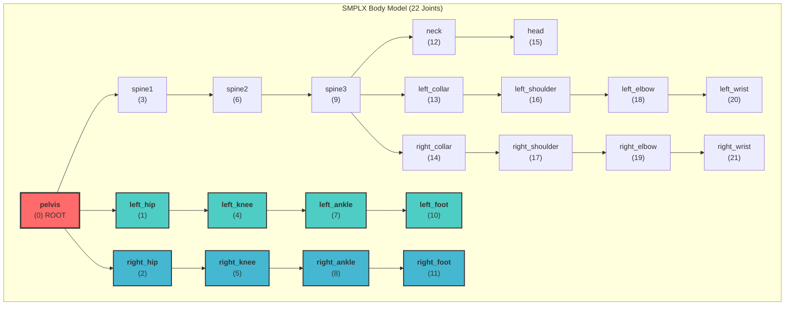

# SMPLX Body Model Skeleton

SMPLX has 22 body joints (excluding hands/face). Here's the kinematic tree:

## SMPLX Joint Hierarchy



## SMPLX → WildRobot Mapping

Only the **leg joints** are used for WildRobot retargeting:

```
SMPLX Joint          WildRobot Joint         Notes
─────────────────────────────────────────────────────────────
pelvis          →    root (floating base)    Position + Orientation

left_hip        →    left_hip_pitch          3-DOF → 2-DOF
                     left_hip_roll           (yaw discarded)

left_knee       →    left_knee_pitch         1-DOF

left_ankle      →    left_ankle_pitch        3-DOF → 1-DOF
left_foot                                    (roll/yaw discarded)

right_hip       →    right_hip_pitch         3-DOF → 2-DOF
                     right_hip_roll          (yaw discarded)

right_knee      →    right_knee_pitch        1-DOF

right_ankle     →    right_ankle_pitch       3-DOF → 1-DOF
right_foot                                   (roll/yaw discarded)
```

## Visual Representation

```
                    HEAD (15)
                      │
                    NECK (12)
                      │
    L_WRIST(20)─L_ELBOW(18)─L_SHOULDER(16)─L_COLLAR(13)
                      │                         │
                   SPINE3 (9)───────────────R_COLLAR(14)─R_SHOULDER(17)─R_ELBOW(19)─R_WRIST(21)
                      │
                   SPINE2 (6)
                      │
                   SPINE1 (3)
                      │
                ┌─────┴─────┐
                │  PELVIS   │  ← ROOT (0)
                │    (0)    │
                └─────┬─────┘
               ┌──────┴──────┐
               │             │
          L_HIP (1)     R_HIP (2)
               │             │
          L_KNEE (4)    R_KNEE (5)
               │             │
         L_ANKLE (7)   R_ANKLE (8)
               │             │
          L_FOOT (10)  R_FOOT (11)
               │             │
              ─┴─           ─┴─
            (ground)      (ground)
```

## Key Points for AMP Training

1. **Pelvis is ROOT**: All body motion is relative to pelvis
   - Pelvis position → `root_pos` (3D)
   - Pelvis orientation → `root_rot` (quaternion)
   - Pelvis has NO dedicated joint angle (it's the floating base)

2. **No waist_yaw in SMPLX**: Human torso rotation comes from:
   - Pelvis rotation (main heading)
   - Distributed spine twist (spine1-3)
   - WildRobot's `waist_yaw` was removed since SMPLX can't provide it

3. **Leg joints used**: Only 8 DOFs for locomotion
   - 4 joints per leg (hip_pitch, hip_roll, knee_pitch, ankle_pitch)
   - Arms/spine ignored for walking

4. **Scale factor 0.55**: WildRobot is ~55% of human height (1.8m)

## SMPLX Joint Index Reference

| Index | Joint Name | Parent | Used by WildRobot |
|-------|------------|--------|-------------------|
| 0 | pelvis | - | ✅ (root) |
| 1 | left_hip | pelvis | ✅ |
| 2 | right_hip | pelvis | ✅ |
| 3 | spine1 | pelvis | ❌ |
| 4 | left_knee | left_hip | ✅ |
| 5 | right_knee | right_hip | ✅ |
| 6 | spine2 | spine1 | ❌ |
| 7 | left_ankle | left_knee | ✅ |
| 8 | right_ankle | right_knee | ✅ |
| 9 | spine3 | spine2 | ❌ |
| 10 | left_foot | left_ankle | ✅ |
| 11 | right_foot | right_ankle | ✅ |
| 12 | neck | spine3 | ❌ |
| 13 | left_collar | spine3 | ❌ |
| 14 | right_collar | spine3 | ❌ |
| 15 | head | neck | ❌ |
| 16 | left_shoulder | left_collar | ❌ |
| 17 | right_shoulder | right_collar | ❌ |
| 18 | left_elbow | left_shoulder | ❌ |
| 19 | right_elbow | right_shoulder | ❌ |
| 20 | left_wrist | left_elbow | ❌ |
| 21 | right_wrist | right_elbow | ❌ |
